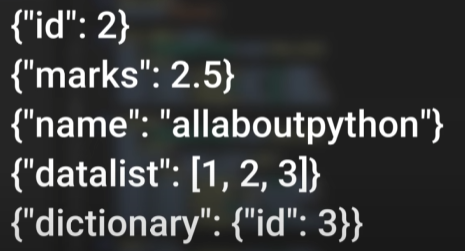
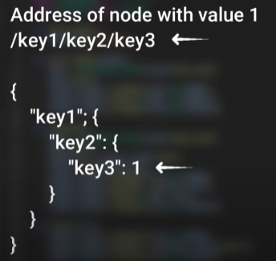

# Connect Firebase using Python
__Firebase__ real-time database is NoSQL(no sequral database) that allow developer is store and synchronize the data in real time.

Step 1: go to `https://firebase.google.com/`

Step 2: Click on `Get Started`


Step 3: click on `Create a Project`


Step 4: Give `Name of Project`


Step 5: Go to `Build` & Click on `Realtime database`


Step 6: `Create a database` for you project


`Locked mode`: Grant access to certain accounts. <br>
`Test Mode` : Grant access to anyone with the link can access the account.


`Database URL`: This means our database is ready to work. we are using this to access our database


__Note__: This is no sequeal database which mean there is no concept of `tables`, `keys` and `relationship`. Instead it is using json like object to store the data inside it called node. 
* Developer can create this node as key value pair. and store common data type like float, integer, string, list, & dictionary inside it.


`Each node has it's own path`
 <br>
Example


Step 7: `Install the firebase library` <br>
cmd: `pip install firebase_admin`

Step 8: `Go to project setting`


Step 9: `Save the file to you computer`

Step 10: Python code
```python
# import library
import firebase_admin
from firebase_admin import db, credentials
```

```python
#authenticate to firebase
url = "https://test-project-626e2-default-rtdb.asia-southeast1.firebasedatabase.app/"
cred = credentials.Certificate("credentials.json")
firebase_admin.initialize_app(cred, {"databaseURL" : url })
```

```python
# creating reference to root node
ref = db.reference("/")
```

```python
# retrieving data from root node
print(ref.get())
```

```python
print(db.reference("/videos").get())
```

```python
# set operation
db.reference("/videos").set(3)

# update operation (update existing value)
db.reference("/").update({"language":"python"})

# update operation (Add new key value)
db.reference("/").update({"subscribed": True})

# push operation
db.reference("/titles").push().set("Create modern UI in python")

# delete operation
db.reference("/language").delete()

# retrieving the data 
ref.get()
```

